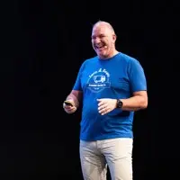

# Hi by Riccardo!

* Blog: https://ricc.rocks/
* Work: Developer Advocate, Google Cloud.
* Languages: Ruby, Python, Bash
* Super Powers: Gemini CLI, SRE, CI/CD, DevOps, Demos.
* [My Next Talks](https://portfolio-app-272932496670.europe-west1.run.app/next-talks) (super up-to-date!!)

🐦 [Twitter](https://x.com/palladius)
☁️ [BlueSky](https://bsky.app/profile/palladius.bsky.social)
🐘 [Mastodon](https://bologna.one/@riccardo)
💼 [Linkedin](https://www.linkedin.com/in/riccardocarlesso/)
🔗 [Blog](https://ricc.rocks/en/)
🌳 [LinkTree](https://linktr.ee/palladius)
📅 [Sessionize](https://sessionize.com/riccardo-carlesso/)
📝 [Medium](https://medium.com/@palladiusbonton)
👨‍💻 Google Developer
🐙 [GitHub](https://github.com/palladius/)
📂 [Sessions and Bio on GH](https://github.com/palladius/my-sessions-and-bio)
📹 [YouTube](https://www.youtube.com/@riccardocarlesso)
🎤 [SpeakerDeck](https://speakerdeck.com/palladius)

<!-- useless
📰 [Substack](https://palladius.substack.com/)

-->
